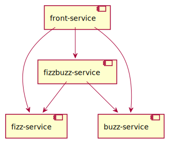
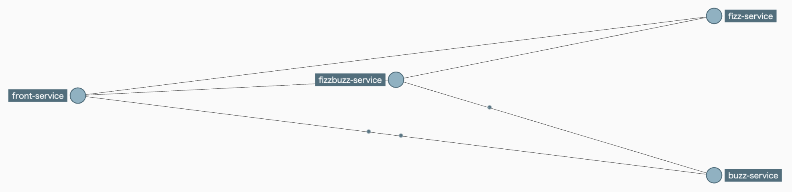

# distributed-tracing

[Spring Cloud Sleuth](https://spring.io/projects/spring-cloud-sleuth)と[Zipkin](https://zipkin.io/)を使った分散トレーシングのデモ。



## 動作確認

### 準備

Zipkinを起動する。

```sh
docker run -d --name zipkin -p 9411:9411 openzipkin/zipkin
```

次のURLでトレースを検索・確認できる。

- http://localhost:9411/zipkin/

### サービス起動

4つのサービスを起動する。

```sh
mvn -f front-service spring-boot:run
mvn -f fizz-service spring-boot:run
mvn -f buzz-service spring-boot:run
mvn -f fizzbuzz-service spring-boot:run
```

STSで起動しても良い(サービス全部選んで起動ボタンを押すだけなので簡単)。

### トレースの確認

まずはサービスを実行する。

```sh
for i in {1..15}; do curl -s localhost:8080/${i}; echo ""; sleep .1; done
```

```
1
2
Fizz
4
Buzz
Fizz
7
8
Fizz
Buzz
11
Fizz
13
14
FizzBuzz
```

トレースを確認する。


サービスの依存関係も見られる。



### Docker Composeで確認する

まずコンテナイメージを作る

```sh
ls | grep service | xargs -t -I {} mvn -f {} spring-boot:build-image
```

Docker Composeでサービスを起動する。

```sh
docker compose up -d
```

トレースの確認をする。
