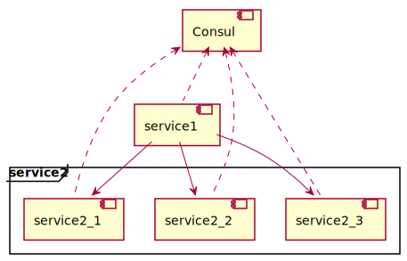
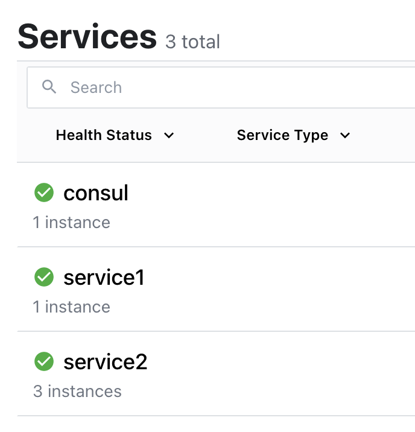

# consul-example

[Consul](https://www.consul.io/)によるService Discovery/Client Side Load Balancingの例。



## 動作確認

まずコンテナイメージを作る。

```sh
ls | grep service | xargs -t -I {} mvn -f {} spring-boot:build-image
```

Docker Composeでサービスを起動する。
このとき`service2`のスケールを`3`に設定しておく。

```sh
docker compose up -d --scale service2=3
```

Consulの管理画面が次のURLで確認できる。

- http://localhost:8500

サービスのHealth Statusがグリーンになれば準備完了。



新しいターミナルを開いて次のコマンドで1秒毎にリクエストを送信し続ける。

```sh
while true; do curl -s localhost:8080/id; echo ""; sleep 1; done
```

`servie1`から`service2`がラウンドロビンで呼び出されていることがわかる。

```
{"id":"service2-1a0e6c258b9589cca1dfdbcc9bb7adec"}
{"id":"service2-2f56b081b401c02e50fbf77d86998523"}
{"id":"service2-a457d5fd491cb485f93e4b9baface35b"}
{"id":"service2-1a0e6c258b9589cca1dfdbcc9bb7adec"}
{"id":"service2-2f56b081b401c02e50fbf77d86998523"}
{"id":"service2-a457d5fd491cb485f93e4b9baface35b"}
```

ここで`servie2_3`を停止してみる。
なおDocker Composeではスケールを変更してもエラーになって反映されなかったため`docker`コマンドで停止している。

```sh
docker stop service-discovery-demo_consul_service2_3
```

`service2`のインスタンスが1つ減っていることがわかる。

```
{"id":"service2-1a0e6c258b9589cca1dfdbcc9bb7adec"}
{"id":"service2-2f56b081b401c02e50fbf77d86998523"}
{"id":"service2-a457d5fd491cb485f93e4b9baface35b"}
{"id":"service2-2f56b081b401c02e50fbf77d86998523"}
{"id":"service2-a457d5fd491cb485f93e4b9baface35b"}
{"id":"service2-2f56b081b401c02e50fbf77d86998523"}
{"id":"service2-a457d5fd491cb485f93e4b9baface35b"}
{"id":"service2-2f56b081b401c02e50fbf77d86998523"}
{"id":"service2-a457d5fd491cb485f93e4b9baface35b"}
```

`service_3`を再開してみる。

```sh
docker start service-discovery-demo_consul_service2_3
```

インスタンスが3つに戻ったことがわかる。

```
{"id":"service2-a457d5fd491cb485f93e4b9baface35b"}
{"id":"service2-2f56b081b401c02e50fbf77d86998523"}
{"id":"service2-a457d5fd491cb485f93e4b9baface35b"}
{"id":"service2-2f56b081b401c02e50fbf77d86998523"}
{"id":"service2-a457d5fd491cb485f93e4b9baface35b"}
{"id":"service2-a457d5fd491cb485f93e4b9baface35b"}
{"id":"service2-2f56b081b401c02e50fbf77d86998523"}
{"id":"service2-836c50b812bdcb584a27f99372b1c95d"}
{"id":"service2-a457d5fd491cb485f93e4b9baface35b"}
{"id":"service2-2f56b081b401c02e50fbf77d86998523"}
{"id":"service2-836c50b812bdcb584a27f99372b1c95d"}
{"id":"service2-a457d5fd491cb485f93e4b9baface35b"}
{"id":"service2-2f56b081b401c02e50fbf77d86998523"}
{"id":"service2-836c50b812bdcb584a27f99372b1c95d"}
```
