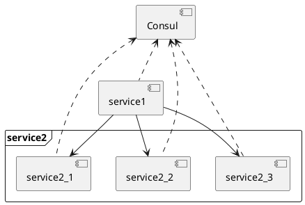

```plantuml
@startuml service-diagram
[Consul]
[service1]
frame service2 {
    [service2_1]
    [service2_2]
    [service2_3]
}

[Consul] <.. [service1]
[Consul] <.. [service2_1]
[Consul] <.. [service2_2]
[Consul] <.. [service2_3]

[service1] --> [service2_1]
[service1] --> [service2_2]
[service1] --> [service2_3]
@enduml
```
